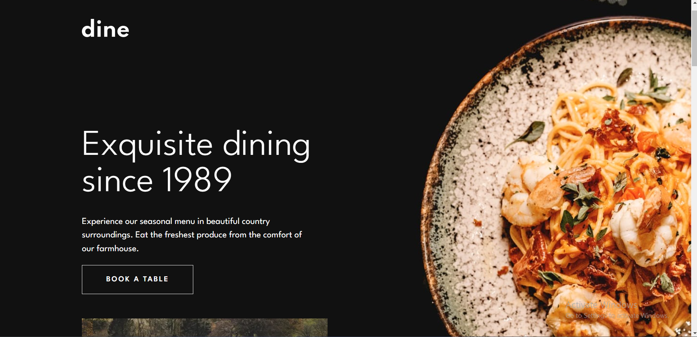
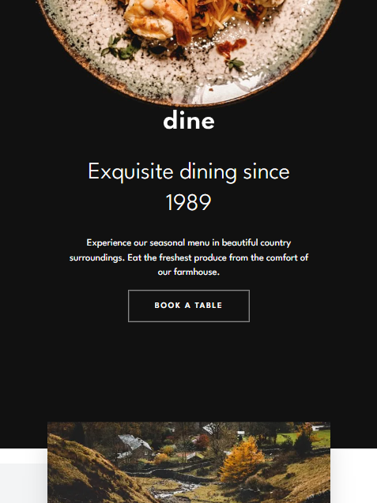
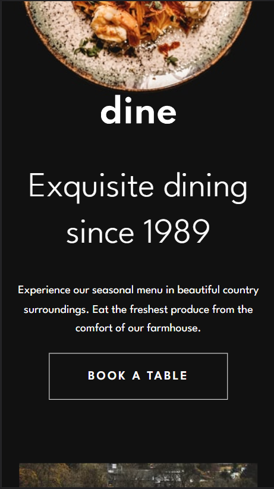

# Dine
Welcome to Dine, a restaurant project built with Next.JS and TailwindCSS. Our project is mobile responsive, multi-page and designed to provide an easy and seamless experience for users.

## Features
- Built with Next.JS, a popular React framework for building web apps
- Styled with TailwindCSS, a utility-first CSS framework
- Mobile responsive design for optimal viewing on all devices
- Multi-page layout for easy navigation

## Functionality
Please note that while the project is fully designed, the form is currently not functional. We apologize for any inconvenience and are working to implement this feature as soon as possible.

## Installation
1. Clone the repository

`git clone https://github.com/<username>/dine.git`

2. Install dependencies
`npm install`

3. Start the development server

`npm run dev`

## Screenshots
### Desktop

### Tablet

### Mobile
